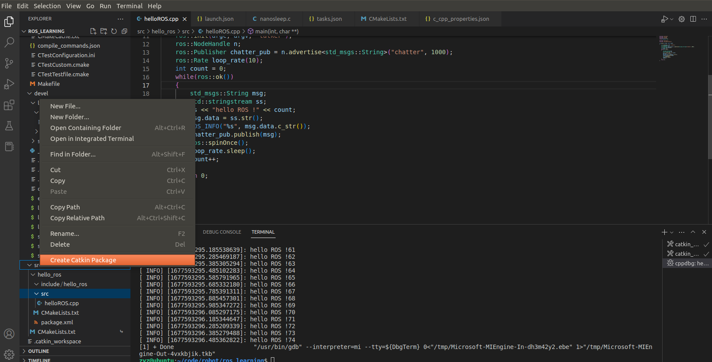
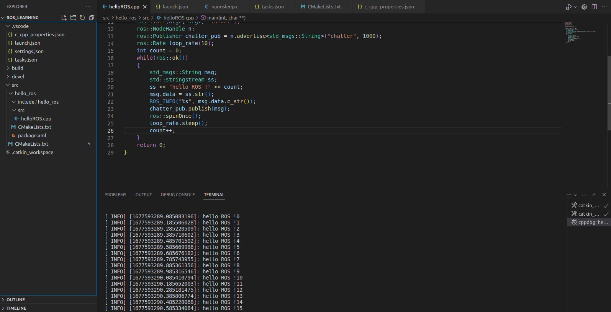

# 1 环境信息
操作系统 ubuntu18.04 64位

ros melodic

# 2 ros安装
参考 http://wiki.ros.org/cn/melodic/Installation/Ubuntu
安装桌面完整版 ros-melodic-desktop-full

# 3 vscode配置
## 3.1 插件
打开vscode 安装 c/c++、ROS、CMake、CMake tools、code runner插件

## 3.2 初始化ros工程
```shell
mkdir ~/ros_learning # 创建工作空间
cd ~/ros_learning
mkdir src
cd src
catkin_init_workspace # 初始化工作空间
cd ..
catkin_make -DCMAKE_EXPORT_COMPILE_COMMANDS=1
```
上述最后一行的命令可在build文件夹下生成compile_commands.json文件。
# 4 在vscode中配置ROS工作环境
## 4.1 配置工程目录
使用VSCode打开ros_learning文件夹。在src目录上右键、选择Create Catkin Package

创建功能包 命名为hello_ros,回车后添加roscpp、rospy依赖，继续在src/hello_ros/src目录下添加一个cpp文件，命名为helloROS.cpp，内容如下：
```c++
#include <iostream>
#include <string>
#include <sstream>
using namespace std;

#include "ros/ros.h"
#include "std_msgs/String.h"

int main(int argc, char** argv)
{
    ros::init(argc, argv, "talker");
    ros::NodeHandle n;
    ros::Publisher chatter_pub = n.advertise<std_msgs::String>("chatter", 1000);
    ros::Rate loop_rate(10);
    int count = 0;
    while(ros::ok())
    {
        std_msgs::String msg;
        std::stringstream ss;
        ss << "hello ROS !" << count;
        msg.data = ss.str();
        ROS_INFO("%s", msg.data.c_str());
        chatter_pub.publish(msg);
        ros::spinOnce();
        loop_rate.sleep();
        count++;
    }
    return 0;
}
```
## 4.2 配置c_cpp_properties.json
- c_cpp_properties.json用于配置编译器环境，包括启动器代号、位数、编译选项、启动设置、编译模式等。
  
打开c_cpp_properties.json，将其内容配置为
```json
{
    "configurations": [
        {
            "browse": {
                "databaseFilename": "${default}",
                "limitSymbolsToIncludedHeaders": false
            },
            "includePath": [
                "/opt/ros/melodic/include/**",
                "/usr/include/**",
                "${workspaceFolder}/**"
            ],
            "name": "ROS",
            "intelliSenseMode": "gcc-x64",
            "compilerPath": "/usr/bin/gcc",
            "cStandard": "gnu11",
            "cppStandard": "c++17",
            "compileCommands": "${workspaceFolder}/build/compile_commands.json"
        }
    ],
    "version": 4
}
```
## 4.3 配置launch.json
- launch.json是vscode用于配置调试信息的文件，比如制定调试语言环境，指定调试类型等。

按F5启动调试，会自动生成launch.json文件，将其内容修改为
```json
{
    "version": "0.2.0",
    "configurations": [
        {
            "name": "(gdb) Launch",
            "type": "cppdbg",
            "request": "launch",
            "program": "${workspaceFolder}/devel/lib/hello_ros/hello_ros",
            "args": [],
            "stopAtEntry": false,
            "cwd": "${workspaceFolder}",
            "environment": [],
            "externalConsole": false,
            "MIMode": "gdb",
            "setupCommands": [
                {
                    "description": "Enable pretty-printing for gdb",
                    "text": "-enable-pretty-printing",
                    "ignoreFailures": true
                }
            ]
        }
    ]
}
```

## 4.4配置 task.json
- task.json用于编译

按F1找到配置任务，将task.json的内容配置如下
```json
{
    "version": "2.0.0",
    "tasks": [
        {
            "label": "catkin_make", //代表提示的描述性信息
            "type": "shell",  //可以选择shell或者process,如果是shell代码是在shell里面运行一个命令，如果是process代表作为一个进程来运行
            "command": "catkin_make",//这个是我们需要运行的命令
            "args": ["-DCMAKE_EXPORT_COMPILE_COMMANDS=1"],//如果需要在命令后面加一些后缀，可以写在这里，比如-DCATKIN_WHITELIST_PACKAGES=“pac1;pac2”
            "group": {"kind":"build","isDefault":true},
            "presentation": {
                "reveal": "always",//可选always或者silence，代表是否输出信息
                "panel": "new"
            },
            "problemMatcher": "$msCompile"
        },
    ]
}
```

## 4.5配置CMakeLists.txt
修改修改src/hello_ros/CMakeLists.txt文件，将其配置为如下内容：
```txt
cmake_minimum_required(VERSION 3.0.2)
project(hello_ros)

## Compile as C++11, supported in ROS Kinetic and newer
# add_compile_options(-std=c++11)

## Find catkin macros and libraries
## if COMPONENTS list like find_package(catkin REQUIRED COMPONENTS xyz)
## is used, also find other catkin packages
find_package(catkin REQUIRED COMPONENTS
  roscpp
  rospy
)

## System dependencies are found with CMake's conventions
# find_package(Boost REQUIRED COMPONENTS system)


## Uncomment this if the package has a setup.py. This macro ensures
## modules and global scripts declared therein get installed
## See http://ros.org/doc/api/catkin/html/user_guide/setup_dot_py.html
# catkin_python_setup()

################################################
## Declare ROS messages, services and actions ##
################################################

## To declare and build messages, services or actions from within this
## package, follow these steps:
## * Let MSG_DEP_SET be the set of packages whose message types you use in
##   your messages/services/actions (e.g. std_msgs, actionlib_msgs, ...).
## * In the file package.xml:
##   * add a build_depend tag for "message_generation"
##   * add a build_depend and a exec_depend tag for each package in MSG_DEP_SET
##   * If MSG_DEP_SET isn't empty the following dependency has been pulled in
##     but can be declared for certainty nonetheless:
##     * add a exec_depend tag for "message_runtime"
## * In this file (CMakeLists.txt):
##   * add "message_generation" and every package in MSG_DEP_SET to
##     find_package(catkin REQUIRED COMPONENTS ...)
##   * add "message_runtime" and every package in MSG_DEP_SET to
##     catkin_package(CATKIN_DEPENDS ...)
##   * uncomment the add_*_files sections below as needed
##     and list every .msg/.srv/.action file to be processed
##   * uncomment the generate_messages entry below
##   * add every package in MSG_DEP_SET to generate_messages(DEPENDENCIES ...)

## Generate messages in the 'msg' folder
# add_message_files(
#   FILES
#   Message1.msg
#   Message2.msg
# )

## Generate services in the 'srv' folder
# add_service_files(
#   FILES
#   Service1.srv
#   Service2.srv
# )

## Generate actions in the 'action' folder
# add_action_files(
#   FILES
#   Action1.action
#   Action2.action
# )

## Generate added messages and services with any dependencies listed here
# generate_messages(
#   DEPENDENCIES
#   std_msgs  # Or other packages containing msgs
# )

################################################
## Declare ROS dynamic reconfigure parameters ##
################################################

## To declare and build dynamic reconfigure parameters within this
## package, follow these steps:
## * In the file package.xml:
##   * add a build_depend and a exec_depend tag for "dynamic_reconfigure"
## * In this file (CMakeLists.txt):
##   * add "dynamic_reconfigure" to
##     find_package(catkin REQUIRED COMPONENTS ...)
##   * uncomment the "generate_dynamic_reconfigure_options" section below
##     and list every .cfg file to be processed

## Generate dynamic reconfigure parameters in the 'cfg' folder
# generate_dynamic_reconfigure_options(
#   cfg/DynReconf1.cfg
#   cfg/DynReconf2.cfg
# )

###################################
## catkin specific configuration ##
###################################
## The catkin_package macro generates cmake config files for your package
## Declare things to be passed to dependent projects
## INCLUDE_DIRS: uncomment this if your package contains header files
## LIBRARIES: libraries you create in this project that dependent projects also need
## CATKIN_DEPENDS: catkin_packages dependent projects also need
## DEPENDS: system dependencies of this project that dependent projects also need
catkin_package(
  CATKIN_DEPENDS
#  INCLUDE_DIRS include
#  LIBRARIES hello_ros
#  CATKIN_DEPENDS roscpp rospy
#  DEPENDS system_lib
)

###########
## Build ##
###########

## Specify additional locations of header files
## Your package locations should be listed before other locations
include_directories(
include
  ${catkin_INCLUDE_DIRS}
)

## Declare a C++ library
# add_library(${PROJECT_NAME}
#   src/${PROJECT_NAME}/hello_ros.cpp
# )

## Add cmake target dependencies of the library
## as an example, code may need to be generated before libraries
## either from message generation or dynamic reconfigure
# add_dependencies(${PROJECT_NAME} ${${PROJECT_NAME}_EXPORTED_TARGETS} ${catkin_EXPORTED_TARGETS})

## Declare a C++ executable
## With catkin_make all packages are built within a single CMake context
## The recommended prefix ensures that target names across packages don't collide
# add_executable(${PROJECT_NAME}_node src/hello_ros_node.cpp)
add_executable(${PROJECT_NAME} src/helloROS.cpp)
## Rename C++ executable without prefix
## The above recommended prefix causes long target names, the following renames the
## target back to the shorter version for ease of user use
## e.g. "rosrun someones_pkg node" instead of "rosrun someones_pkg someones_pkg_node"
# set_target_properties(${PROJECT_NAME}_node PROPERTIES OUTPUT_NAME node PREFIX "")

## Add cmake target dependencies of the executable
## same as for the library above
# add_dependencies(${PROJECT_NAME}_node ${${PROJECT_NAME}_EXPORTED_TARGETS} ${catkin_EXPORTED_TARGETS})

## Specify libraries to link a library or executable target against
# target_link_libraries(${PROJECT_NAME}_node
#   ${catkin_LIBRARIES}
# )
target_link_libraries(${PROJECT_NAME}
  ${catkin_LIBRARIES}
)
#############
## Install ##
#############

# all install targets should use catkin DESTINATION variables
# See http://ros.org/doc/api/catkin/html/adv_user_guide/variables.html

## Mark executable scripts (Python etc.) for installation
## in contrast to setup.py, you can choose the destination
# catkin_install_python(PROGRAMS
#   scripts/my_python_script
#   DESTINATION ${CATKIN_PACKAGE_BIN_DESTINATION}
# )

## Mark executables for installation
## See http://docs.ros.org/melodic/api/catkin/html/howto/format1/building_executables.html
# install(TARGETS ${PROJECT_NAME}_node
#   RUNTIME DESTINATION ${CATKIN_PACKAGE_BIN_DESTINATION}
# )

## Mark libraries for installation
## See http://docs.ros.org/melodic/api/catkin/html/howto/format1/building_libraries.html
# install(TARGETS ${PROJECT_NAME}
#   ARCHIVE DESTINATION ${CATKIN_PACKAGE_LIB_DESTINATION}
#   LIBRARY DESTINATION ${CATKIN_PACKAGE_LIB_DESTINATION}
#   RUNTIME DESTINATION ${CATKIN_GLOBAL_BIN_DESTINATION}
# )

## Mark cpp header files for installation
# install(DIRECTORY include/${PROJECT_NAME}/
#   DESTINATION ${CATKIN_PACKAGE_INCLUDE_DESTINATION}
#   FILES_MATCHING PATTERN "*.h"
#   PATTERN ".svn" EXCLUDE
# )

## Mark other files for installation (e.g. launch and bag files, etc.)
# install(FILES
#   # myfile1
#   # myfile2
#   DESTINATION ${CATKIN_PACKAGE_SHARE_DESTINATION}
# )

#############
## Testing ##
#############

## Add gtest based cpp test target and link libraries
# catkin_add_gtest(${PROJECT_NAME}-test test/test_hello_ros.cpp)
# if(TARGET ${PROJECT_NAME}-test)
#   target_link_libraries(${PROJECT_NAME}-test ${PROJECT_NAME})
# endif()

## Add folders to be run by python nosetests
# catkin_add_nosetests(test)
```
- add_executable：用于设置需要编译的代码和可执行文件。第一个参数为期望生成的可执行文件名称，后边的参数为参与编译的源码文件（cpp），如果需要多个代码文件，则可在后面依次列出，中间使用空格进行分割。
- target_link_libraries：用于设置链接库。很多功能需要使用系统或第三方的库函数，通过该选项可以配置执行文件链接的库文件，其第一个参数与add_executable相同，是可执行文件的名称，后面依次列出需要链接的库。若未使用其他库，添加默认链接库即可。

以上编译内容会帮助系统生成可执行文件，放置在<workspace>/devel/lib/<package name>下。

# 5 测试结果
按Ctrl+Shift+B进行编译，可以看到与catkin_make一样的编译过程。 新开一个终端，运行roscore启动Master节点。 按F5运行编译生成的可执行文件。可在终端中看到输出。
