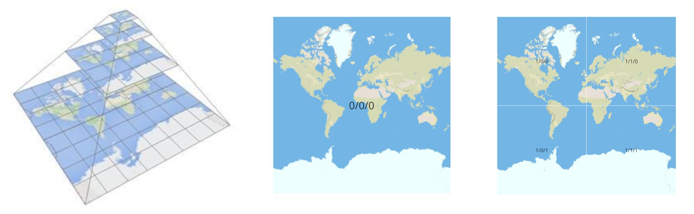
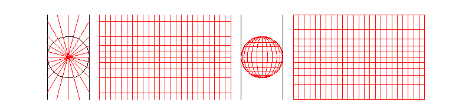
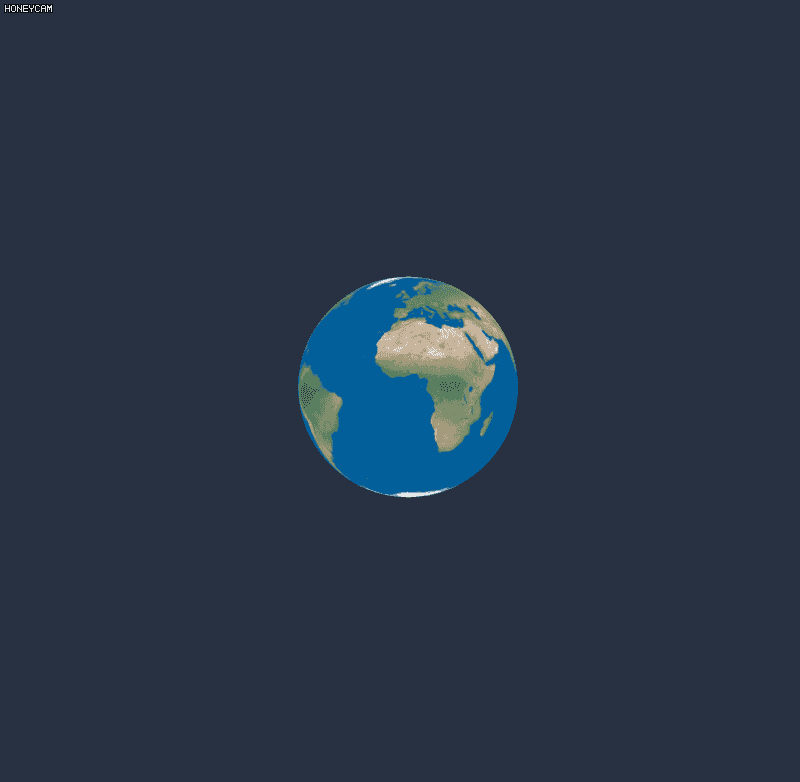

# 概念
在使用web地图时，我们看到的是一张铺满整个屏幕的大的地图图片，实际上，这个大的图片是将多个尺寸相同的小图片按一定规格无缝拼接而成的，这些小的图片就是瓦片。瓦片按金字塔形式组织，每张瓦片都可以通过缩放级别（Z）、列号（X）、行号（Y）来唯一标记，如图所示：
第一张瓦片标记为0/0/0 即缩放级别、行列号均为0，只有一张瓦片覆盖了整个世界地图。

当缩放级别为1，将缩放级别为0的那张瓦片(实际不是这张瓦片、分辨率会有所提升)4等分，得到1/0/0、1/1/0(北半球)和1/0/1、1/1/1（南半球）4张瓦片，以此类推，一般地图最高提供到21级。


# 计算
## 墨卡托(Mercator)投影
墨卡托投影是正轴等角圆柱投影，由荷兰地理学家墨卡托(G.Metcator)于1569年创立。假想一个与地球同轴的圆柱或切或割于地球，按等角条件，将经纬度投影到圆柱面上，将圆柱面展开为平面后，即得本投影。最早也是最常用的是切圆柱投影。投影后，经线是一组竖直的等距离平行直线，纬线是垂直经线的一组平行直线。纬线间隔由赤道向两级增大，一点上任何方向上的长度比均相等，即没有角度变形，而面积变形显著，从基准纬线向两级逐渐增大。因为具有各个方向均等扩大的特性，在地图上可以保持方向和角度的正确，因此常用于航海图和航空图。



## web墨卡托

web墨卡托投影由Google最先发明使用，和墨卡托投影主要区别在于在投影过程中，将表示地图的参考椭球体近似的作为正球体来处理（正球体半径R=椭球体半长轴a），目前已经是web制图的默认地图投影。以赤道作为标准纬线，本初子午线为中央经线，两者交点为坐标原点，向东向北为正，向西向南为负。

X轴：赤道半径取值6378137米，则赤道周长为2*PI*R，以坐标原点为中心，向东西南北各取周长值的一半，即PI*R=20037508.3427892，因此X轴取值范围[-20037508.3427892,20037508.3427892]

Y轴：根据墨卡托计算公式，当纬度趋于两级时，y趋向于无穷大，为了使用方便，就把Y轴的取值范围也限定在[-20037508.3427892,20037508.3427892]之间，形成一个正方形。反算可推出纬度的范围为[-85.05112877980659,85.05112877980659]。

经纬度 墨卡托互转代码
```java
public static final double MAX_MERC = 20037508.3427892;
public static MercatorPoint LngLat2Mercator(LngLatPoint point) {
    double x = point.getLng() * MAX_MERC / 180;
    double y = Math.log(Math.tan((90 + point.getLat()) * Math.PI / 360)) / (Math.PI / 180);
    y = y * MAX_MERC / 180;
    return new MercatorPoint(x, y);
}

public static LngLatPoint Mercator2LngLat(MercatorPoint point) {
    double x = point.getLng() / MAX_MERC * 180;
    double y = point.getLat() / MAX_MERC * 180;
    y = 180 / Math.PI * (2 * Math.atan(Math.exp(y * Math.PI / 180)) - Math.PI / 2);
    return new LngLatPoint(x, y);
}
```
通过XYZ获取tile实例
```java
public static Tile getTile(int z, int x, int y) {
    Tile tile = new Tile();
    tile.setZ(z);
    tile.setX(x);
    tile.setY(y);
    int count = (int) Math.pow(2, z);
    double each = MAX_MERC / ((double) count / 2);
    double each_x = each * x;
    double each_x_1 = each * (x + 1);
    double each_y = each * y;
    double each_y_1 = each * (y + 1);
    tile.setTopLeft(new MercatorPoint(each_x - MAX_MERC, MAX_MERC - each_y));
    tile.setTopRight(new MercatorPoint(each_x_1 - MAX_MERC, MAX_MERC - each_y));
    tile.setBottomLeft(new MercatorPoint(each_x - MAX_MERC, MAX_MERC - each_y_1));
    tile.setBottomRight(new MercatorPoint(each_x_1 - MAX_MERC, MAX_MERC - each_y_1));
    return tile;
}
```
通过墨卡托坐标获取Tile实例
```java
	public static Tile getTile(int zoom, MercatorPoint point) {
		double cx = point.getLng() + MAX_MERC;
		double cy = MAX_MERC - point.getLat();
		int count = (int) Math.pow(2, zoom);
		double each = MAX_MERC / ((double) count / 2);
		int count_x = (int) Math.floor(cx / each);
		int count_y = (int) Math.floor(cy / each);
		Tile tile = getTile(zoom, count_x, count_y);
		return tile;
	}
```
通过经纬度坐标获取Tile实例
```java
public static Tile getTile(int zoom, LngLatPoint point) {
		return getTile(zoom, LngLat2Mercator(point));
	}
```
其它实现参考[GeoUtils](./GeoUtils.java)文件来自[这里](https://gitee.com/CrimsonHu/java_map_download)
